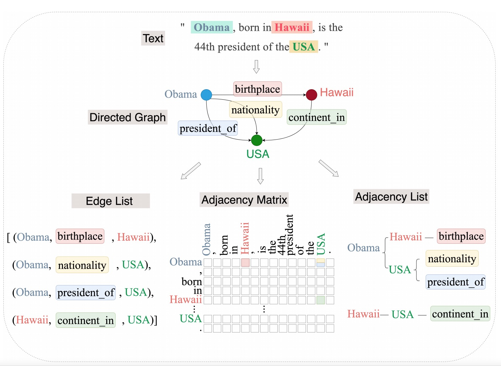

# DIRECT

This is the implementation of the DIRECT model from paper "[Adjacency List Oriented Relational Fact Extraction via Adaptive Multi-task Learning](https://arxiv.org/abs/2106.01559)". 



## Requirements
- botocore==1.19.23
- numpy==1.18.5
- tqdm==4.49.0
- requests==2.24.0
- boto3==1.16.23
- torch==1.6.0+cu101
- tensorflow==2.3.1

## Usage:

1. Download google's pretrained model `bert-base-cased` for PyTorch from huggingface https://huggingface.co/bert-base-cased

2. Download CasRel's data at: https://drive.google.com/drive/folders/1bZlGqjqf51IExb-ILFDq8iSEU6Nrv7qH

3. Run `data/partial/$data$/process.ipynb` to convert the format of data.

4. Run `./train_$data$.sh` to train the model.

5. RUn `./eval.sh` to eval.

## Cite the paper

```
@inproceedings{zhao2021adjacency,
  title={Adjacency List Oriented Relational Fact Extraction via Adaptive Multi-task Learning},
  author={Zhao, Fubang and Jiang, Zhuoren and Kang, Yangyang and Sun, Changlong and Liu, Xiaozhong},
  booktitle={ACL-IJCNLP 2021 Findings},
  year={2021}
}
```